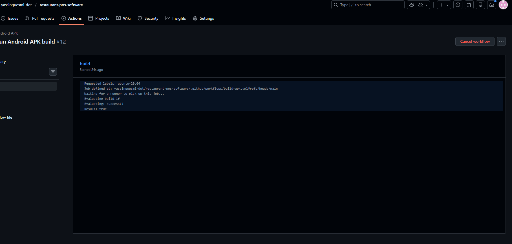

# APK Build Guide - Cafe216 POS

Complete guide to build your Restaurant POS application as an Android APK.

---

## 📱 Quick Start - 3 Methods Available

### Method 1: Buildozer (Linux/WSL) - RECOMMENDED
**Time: 1-2 hours | Difficulty: Medium | Result: Production-ready APK**

This is the official method for building Kivy apps to APK.

### Method 2: Pydroid 3 (Android Device)
**Time: 10 minutes | Difficulty: Easy | Result: Direct testing**

Run Python/Kivy apps directly on Android without building APK.

### Method 3: GitHub Actions (Cloud Build)
**Time: 30 minutes setup | Difficulty: Medium | Result: Automated builds**

Build APKs automatically in the cloud on every commit.

---

## 🔧 Method 1: Buildozer Build (RECOMMENDED)

### Prerequisites

You need a Linux environment. Choose one:
- **WSL2 (Windows Subsystem for Linux)** - Recommended for Windows users
- **Ubuntu Linux** - Native Linux
- **VM (Virtual Machine)** - VirtualBox/VMware with Ubuntu

### Step 1: Setup WSL2 (Windows Users)

```powershell
# In Windows PowerShell (as Administrator)
wsl --install -d Ubuntu-22.04

# After installation, restart and set up Ubuntu username/password
```

### Step 2: Enter Linux Environment

```bash
# Open Ubuntu from Start Menu or:
wsl

# Update the system
sudo apt-get update
sudo apt-get upgrade -y
```

### Step 3: Install Build Dependencies

```bash
# Install Python and build tools
sudo apt-get install -y python3 python3-pip python3-venv git

# Install Buildozer
pip3 install --upgrade buildozer

# Install Cython (required for Kivy)
pip3 install --upgrade cython

# Install required system libraries
sudo apt-get install -y \
    build-essential \
    git \
    ffmpeg \
    libsdl2-dev \
    libsdl2-image-dev \
    libsdl2-mixer-dev \
    libsdl2-ttf-dev \
    libportmidi-dev \
    libswscale-dev \
    libavformat-dev \
    libavcodec-dev \
    zlib1g-dev \
    libgstreamer1.0-dev \
    gstreamer1.0-plugins-base \
    gstreamer1.0-plugins-good \
    zip \
    unzip \
    openjdk-17-jdk \
    autoconf \
    libtool \
    pkg-config
```

### Step 4: Navigate to Your Project

```bash
# From Windows, your C: drive is at /mnt/c/
cd /mnt/c/Users/yassi/Downloads/restaurant-pos-software\ \(2\)/restaurant-pos-software\ \(1\)/

# Or copy project to Linux home directory (faster builds)
cp -r /mnt/c/Users/yassi/Downloads/restaurant-pos-software\ \(2\)/restaurant-pos-software\ \(1\)/ ~/cafe216-pos
cd ~/cafe216-pos
```

### Step 5: Build the APK

#### Option A: Use the automated script

```bash
# Make script executable
chmod +x build_apk.sh

# Run the build script
./build_apk.sh
```

#### Option B: Manual build

```bash
# Clean previous builds (optional, first time not needed)
# buildozer android clean

# Build debug APK (for testing)
buildozer -v android debug

# Or build release APK (for distribution)
# buildozer -v android release
```

### Step 6: Locate Your APK

After successful build:
```bash
# APK will be in bin/ directory
ls -lh bin/

# Output example:
# bin/cafe216pos-1.0-debug.apk
```

### Step 7: Transfer APK to Android Device

#### Method A: USB Transfer
1. Copy APK to Windows: `cp bin/*.apk /mnt/c/Users/yassi/Downloads/`
2. Connect Android device via USB
3. Copy APK to device
4. Open APK file on device and install

#### Method B: ADB (Android Debug Bridge)
```bash
# Install ADB
sudo apt-get install android-tools-adb

# Connect device via USB with USB Debugging enabled
adb devices

# Install APK
adb install bin/cafe216pos-1.0-debug.apk
```

#### Method C: Cloud Transfer
- Upload to Google Drive / Dropbox
- Download on Android device
- Install

---

## 📲 Method 2: Pydroid 3 (Quick Testing)

### Best for: Quick testing without full build

1. **Install Pydroid 3**
   - Open Google Play Store on Android device
   - Search "Pydroid 3"
   - Install the app (free version works fine)

2. **Install Dependencies**
   ```python
   # In Pydroid 3 Terminal:
   pip install kivy pillow
   ```

3. **Copy Project Files**
   - Copy `main_kivy.py` to Pydroid 3
   - Create `ui/` folder
   - Copy `ui/main.kv` to the ui folder

4. **Run Directly**
   - Open `main_kivy.py` in Pydroid 3
   - Press the Run button
   - App runs directly on device

**Pros:** Fast, no build needed, instant testing  
**Cons:** Not a standalone APK, requires Pydroid 3 installed

---

## ☁️ Method 3: GitHub Actions (Automated Cloud Build)

### Setup CI/CD Pipeline

1. **Create `.github/workflows/build-apk.yml`:**

```yaml
name: Build APK

on:
  push:
    branches: [ main ]
  workflow_dispatch:

jobs:
  build:
    runs-on: ubuntu-latest
    
    steps:
    - uses: actions/checkout@v3
    
    - name: Set up Python
      uses: actions/setup-python@v4
      with:
        python-version: '3.11'
    
    - name: Install dependencies
      run: |
        sudo apt-get update
        sudo apt-get install -y \
          build-essential git ffmpeg libsdl2-dev \
          libsdl2-image-dev libsdl2-mixer-dev \
          libsdl2-ttf-dev libportmidi-dev libswscale-dev \
          libavformat-dev libavcodec-dev zlib1g-dev \
          zip unzip openjdk-17-jdk autoconf libtool
        pip install --upgrade buildozer cython
    
    - name: Build APK
      run: |
        cd "restaurant-pos-software (1)"
        buildozer -v android debug
    
    - name: Upload APK
      uses: actions/upload-artifact@v3
      with:
        name: cafe216-pos-apk
        path: restaurant-pos-software (1)/bin/*.apk
```

2. **Commit and Push**
   - GitHub will automatically build APK
   - Download from Actions tab

---

## 🐛 Troubleshooting

### Build Fails with "SDK not found"
```bash
# Accept SDK licenses
buildozer android clean
yes | buildozer android debug
```

### Build Fails with Network Errors (WSL)
```bash
# Check internet connectivity
ping google.com

# If DNS fails, add to /etc/resolv.conf:
echo "nameserver 8.8.8.8" | sudo tee /etc/resolv.conf

# Restart WSL
wsl --shutdown  # In Windows PowerShell
wsl  # Restart
```

### Build Takes Too Long
- First build: 30-60 minutes (downloads SDK, NDK, dependencies)
- Subsequent builds: 5-10 minutes
- Building on Linux (not WSL) is faster

### Java Version Issues
```bash
# Install correct Java version
sudo apt-get install openjdk-17-jdk

# Set default Java
sudo update-alternatives --config java
```

### Out of Disk Space
```bash
# Check space
df -h

# Clean buildozer cache
rm -rf ~/.buildozer
rm -rf .buildozer
```

### APK Won't Install on Device
- Enable "Install from Unknown Sources" in Android settings
- Check if you have space on device
- Try installing via ADB: `adb install -r bin/*.apk`

---

## 📋 Build Configuration

The build is configured in `buildozer.spec`:

### Key Settings:
- **Package Name:** cafe216pos
- **Version:** 1.0
- **Orientation:** Landscape (tablet-optimized)
- **Minimum Android:** API 21 (Android 5.0)
- **Target Android:** API 31 (Android 12)
- **Architecture:** arm64-v8a, armeabi-v7a (supports most devices)
- **Permissions:** Internet, Storage (for data backup)

### Modify Version:
```ini
# In buildozer.spec
version = 1.1
```

### Add App Icon:
```ini
# In buildozer.spec
icon.filename = %(source.dir)s/icon.png
```
Then add `icon.png` (512x512 px) to project root.

---

## ✅ Build Checklist

Before building:
- [ ] All Python files in project root
- [ ] `ui/main.kv` file exists
- [ ] `buildozer.spec` configured
- [ ] Internet connection active
- [ ] At least 10 GB free disk space
- [ ] Linux/WSL environment ready

During build:
- [ ] Accept SDK licenses when prompted
- [ ] Wait patiently (first build is slow)
- [ ] Check build logs for errors

After build:
- [ ] APK file exists in `bin/` directory
- [ ] APK size is reasonable (10-50 MB)
- [ ] Test on real Android device
- [ ] Verify all screens work
- [ ] Test login functionality

---

## 🚀 Release Build (Production)

For publishing to Play Store or distribution:

```bash
# Build release APK
buildozer android release

# APK will be unsigned
# Sign with your keystore:
jarsigner -verbose -sigalg SHA1withRSA -digestalg SHA1 \
  -keystore my-release-key.keystore \
  bin/cafe216pos-1.0-release-unsigned.apk \
  alias_name

# Align the APK
zipalign -v 4 \
  bin/cafe216pos-1.0-release-unsigned.apk \
  bin/cafe216pos-1.0-release.apk
```

---

## 📚 Additional Resources

- [Buildozer Documentation](https://buildozer.readthedocs.io/)
- [Kivy Android Documentation](https://kivy.org/doc/stable/guide/packaging-android.html)
- [Python-for-Android](https://python-for-android.readthedocs.io/)
- [WSL Setup Guide](https://docs.microsoft.com/en-us/windows/wsl/install)

---

## 💡 Tips

1. **First Build:** Will take 30-60 minutes. Be patient!
2. **Incremental Builds:** Only 5-10 minutes after first build
3. **Test on Real Device:** Emulators can be unreliable for Kivy apps
4. **Keep Buildozer Updated:** `pip install --upgrade buildozer`
5. **Debug Mode First:** Test thoroughly before building release
6. **Check Logs:** Look in `.buildozer/logs/` for detailed error messages
7. **Clean Build:** If stuck, try `buildozer android clean` then rebuild

---

## 🎯 Summary

**For Production APK:** Use Method 1 (Buildozer)  
**For Quick Testing:** Use Method 2 (Pydroid 3)  
**For Automation:** Use Method 3 (GitHub Actions)

Your project is now ready to build! Choose your method and follow the steps above.

Good luck! 🚀


